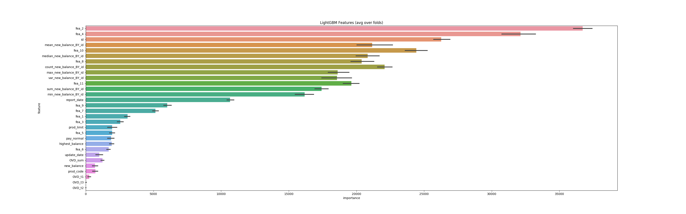
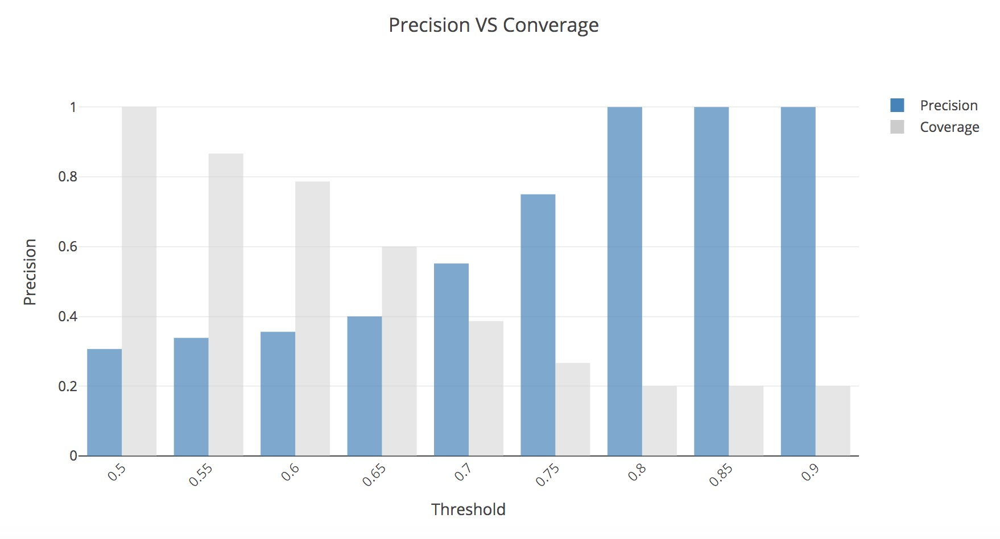

# Anomaly Detection
Quick prototype of a anomaly detection model for OCBC bank to predict high credit risk customer using tree-based model

# Probelm Description

The problem is given a costmers' demographic data and his payment history data, to clasify this customer into high credit risk
or low credit risk customer.
So, we formulate this problem into binary classifcation task.

# Outline

- To begin, I do explorary data analysis(EDA) to get better understanding of data. 
Specifically, I check data imbalance, if missing value happens, raw feature density distribution,.. etc.

For more details, please see **notebook/EDA.ipynb** (I have more comments with visualization result inside the notebook file) 

- Secondly, I do feature engineering to build some features manually.

Except raw feature, I add some features representing how many times the customer has record and compute
max,min,std,mean,..etc statistical features of new blance groupby customer.

To see which features are more important, please refer to the below top 30 important features:


For more details, please see **src/main.py, src/util.py and src/config.py** to see how I generated features.

- Thirdly, build the predictive modeling to predict high risk customer. To do that, the things I did in the following

**train/test split**

Sample 10% of total costomer from data: 112 unique user as a testing data for model evaluation

**validating stragety**

Due to lack of data(less than 10,000), I choose 10-fold validating stategy to make sure our model 
won't be overfitted too much on testing data.

**model**

We choose tree-based model using lightgbm as our predictive modeling because it's undoubtedly powerful for tabular data.

For more details, please see **src/main.py, src/util.py and src/config.py** to see how I trained model and 10-fold.

**evaluation metric**

Because of data imbalance, we generally choose **f1-score** as our evaluation metric. Usually, for anomaly detection,
we can have customized evaluation metric weighted by we care about more on precision or recall.

# Result Analysis

- 10-fold validating result:
  Overall, we have **0.961538 f1-score** over 10-fold.
  
For the validating f1-score, could refer to result/200112-1527.log****

- testing reuslt analysis:

For better understaind model's predicting result, I plot confusion matrix plot, please find it on **notebook/EDA.ipynb**

Also, I show precision vs coverage based on distinct threshold(how confident the model think of it's high credit risk
customer.


To quickly wrap up of the figure:
1. The larger threshold, lower coverage rate but higher precision.

2. Without any threshold limit(coverage 100%), our precision is only 0.3(severely overfitting on validating set but not surprisingly because we have severly lack training data..

3. As we make prediction only when model have 80 % of confidence, we can have 100% precision on testing set.

Again, it might not evidently reflect the real-world situation because the number of sample is too less..

# Usage

Please run the below command line in order.
And the submisison will put under result directory.

### Requirements:

* python 3.6.5+ environment(Highly recommend using virtual enviroment or pull python3 image running script in container)

```sh
pip3 install -r requirements.txt
```

### Training

```sh
cd src
```

```sh
python3 main.py
```


